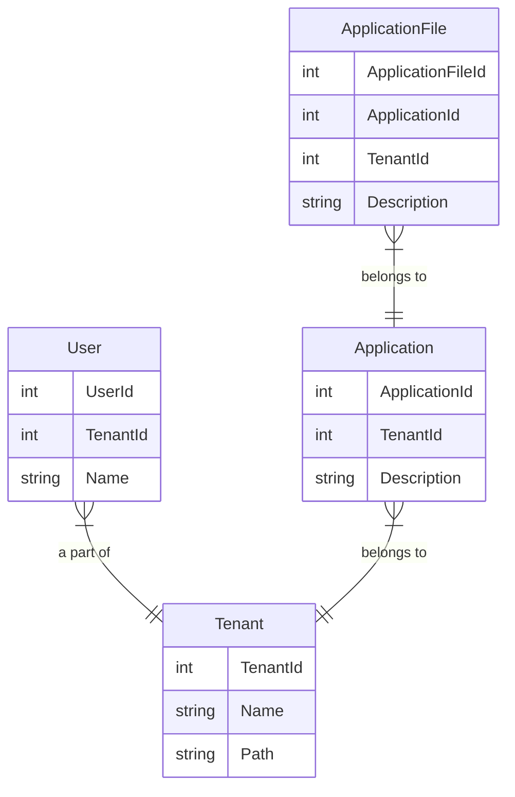

# Intro
The purpose of is to give a basic idea of how row level security works in the real world.
In a nutshell RLS is adding security to stop access to data by some 

### Scenario
- We have users that are linked to a tenant.
- A tenant can have multiple sub-tenants which in term can have sub-tenants. No limit on the depth of the tree.
- We have application that are linked to a tenant
- Applications have files
- A user linked to a tenant should be able to access the tenant and all sub-tenants down the tree

# SQL Guide
## 1. DB Table + View setup

1. Run script 1 in db folder. This creates the DB tables + view as above image
1. Run script 2 to insert some test data
1. Play around with the data in SQL and via API endpoint. *See script 5 for SQL queries* 

| User Id      | User name      | Tenant Path   |
| -------------| -------------  | ------------- | 
| 1             |Iron Man       | \Marvel       |
| 13            | The Thing     | \Marvel\FanasticFour |
| 52            | Wonder Woman  | \DC          |


| Application Id    | Application desc      | Tenant Path           | # Files   | 
| -------------     | -------------         | -------------         | --------  |  
| 1                 | Marvel app 1          | \Marvel               |1          |
| 2                 | Marvel app 2          | \Marvel               |0          |
| 3                 | Averager app 1        | \Marvel\Avengers      |0          |
| 4                 | Fantastic Four app 1  | \Marvel\FanasticFour  |0          |
| 5                 | DC APP 1              | \DC                   |2          |
| 6                 | DC APP 2              | \DC                   |3          |


## 2. Adding helper functions

1. Create security schema. This is considered best practice to contain all functions and policies for RSL (see script 3)
1. Create a reusable function to check the access for an application id. This function helps do the check to see if the session context tenant is in the allowed path (see script 3)

>  SESSION_CONTEXT('UserId') is used to retrieve the value that we will be passed in via our backend.

> We also do a wildcard search on tenant path so that `Iron man` who is set at `\Marvel` can access anything below i.e all applications that are for `Avengers` and `Fanastic Four`

```SQL
CREATE FUNCTION security.CheckAccessForApplicationId(@ApplicationId int)
		RETURNS TABLE
			WITH SCHEMABINDING
			AS
			RETURN SELECT 1 AS accessResult
				   FROM dbo.[User] u
					INNER JOIN dbo.Tenant t on t.TenantId = u.TenantId
					RIGHT JOIN dbo.TenantApplicationView a on a.TenantPath LIKE t.Path+''%''
					WHERE u.UserId = CAST(SESSION_CONTEXT(N''UserId'') AS int)
					AND a.ApplicationId = @ApplicationId
```

If the above function doesn't return a row then it will be treated as that userId doesn't have access.

## 3. Adding the predicate
1. Add the predicate check on the application table (see script 4)

> The `FILTER PREDICATE` takes cares of `SELECT` and `DELETE` statements. since you have to be able to see the info to be able to delete :)


``` SQL
EXECUTE('CREATE SECURITY POLICY security.TenantAccessFilter
	ADD FILTER PREDICATE security.CheckAccessForApplicationId(ApplicationId)
        ON dbo.Application,
    ADD BLOCK PREDICATE security.CheckAccessForApplicationId(ApplicationId)
        ON dbo.Application AFTER INSERT
	WITH (STATE = ON)');
```
## 4. Play around with the data - Select
1. Lets see the select filter enforced. *see script 5*
```SQL 
SELECT *  FROM [dbo].[Application]
```
This returns nothing since the above filter is taking affect.
We need to set the session context key  `UserId` with a value. Lets set it to `The Thing`. Looking at the above tables he should only be able to see 1 application 
```SQL
EXEC sys.sp_set_session_context @key = N'UserId', @value = '13'; 
SELECT *  FROM [dbo].[Application]
```
Continue to play around with different users and see how it filters out the work. 

## 5. Play around with the data - Insert
1. Lets see how well the RLS works for inserting data.
Lets see if Hulk can add a DC application.
```SQL
EXEC sys.sp_set_session_context @key = N'UserId', @value = '5';
INSERT INTO [dbo].[Application]
           ([ApplicationId]
           ,[TenantId]
           ,[Description])
     VALUES
           (7,
		   5, -- DC tenant Id
		   'DC 3');
```
We get an error message that shows us that we are now enforcing RLS so that one tenant won't be able to add new applications for another.
```
The attempted operation failed because the target object 'row_level_security.dbo.Application' has a block predicate that conflicts with this operation. If the operation is performed on a view, the block predicate might be enforced on the underlying table. Modify the operation to target only the rows that are allowed by the block predicate.
```

## 6. Play around with the data - Delete
1. How does it work for deletes.
Lets see if Flash can pull a fast one and delete one of the fanastic fours applications
```SQL
EXEC sys.sp_set_session_context @key = N'UserId', @value = '53'; 
DELETE FROM [dbo].[Application]
WHERE ApplicationId = 4
```
No error message this time but it does say `0 rows affected`

If we change back to a Marvel or Fanastic Four user you will see that application 4 is still there
```
EXEC sys.sp_set_session_context @key = N'UserId', @value = '10'; 
SELECT *FROM [dbo].[Application]
WHERE ApplicationId = 4
```
## 7. What about application files?
1. What about the tables linked to the application?
As the Thing lets see if we can see the files
```SQL
EXEC sys.sp_set_session_context @key = N'UserId', @value = '13';
SELECT *  FROM [row_level_security].[dbo].[ApplicationFile]
```
This returns all the files even though the application for fanastic four doesn't have any linked

2. To fix this we need to add the predicate on every table we want to restrict. 
> Since ApplicationFile has an ApplicationId we can reuse our existing function. However if we had another table that didn't we could create a new function that applies simliar filtering
```SQL
EXECUTE('ALTER SECURITY POLICY security.TenantAccessFilter
	ADD FILTER PREDICATE security.CheckAccessForApplicationId(ApplicationId)
        ON dbo.ApplicationFile,
    ADD BLOCK PREDICATE security.CheckAccessForApplicationId(ApplicationId)
        ON dbo.ApplicationFile AFTER INSERT');
```
3. Run the above query again. Now Thing can't see any files as expected

# API Guide
## 1. Creating a DB interceptor
1. We need to write a DB interceptor that can set the session context UserId
*see SessionContextDbConnectionInterceptor.cs for full code*

> To make things easier we are going to just use a user-id that is passed in the request header. In the real world this will probably be a claim added to your user principal during authenication
 ```C#
 private int? GetUserId()
{
    if (httpContextAccessor.HttpContext != null
        && httpContextAccessor.HttpContext.Request.Headers.TryGetValue("user-id", out var headerUserId))
        return int.Parse(headerUserId.ToString());

    return null;
}
 ```
In both the `ConnectionOpenedAsync` and `ConnectionOpened` method we need to override and set the session context before any queries are run
```C#
 private static DbCommand CreateCommand(DbConnection connection, int userId)
 {
     var cmd = connection.CreateCommand();

     var param = cmd.CreateParameter();
     param.ParameterName = "@key";
     param.Value = "UserId";
     param.DbType = DbType.String;
     cmd.Parameters.Add(param);

     param = cmd.CreateParameter();
     param.ParameterName = "@value";
     param.Value = userId;
     param.DbType = DbType.String;
     cmd.Parameters.Add(param);

     cmd.CommandType = CommandType.StoredProcedure;
     cmd.CommandText = @"sp_set_session_context";
     return cmd;
 }
```
## 2. Adding the interceptor to the DB context

In the `RowLevelSecurityDbContext` we can add the interceptor.
```C#
protected override void OnConfiguring(DbContextOptionsBuilder optionsBuilder)
{
    optionsBuilder.AddInterceptors(new SessionContextDbConnectionInterceptor(_httpContextAccessor));
}
```

## 3. Play around with it
Try hit the endpoint via your favourite http client or via CURL commands below
As Iron man we expect to see 4 applications
```
curl --location --request GET 'https://localhost:7236/Application' --header 'user-id:1'
```
As The Thing we expect to see 1 applications
```
curl --location --request GET 'https://localhost:7236/Application' --header 'user-id:13'
```
As Wonder Woman we expect to see 2 applications
```
curl --location --request GET 'https://localhost:7236/Application' --header 'user-id:52'
```